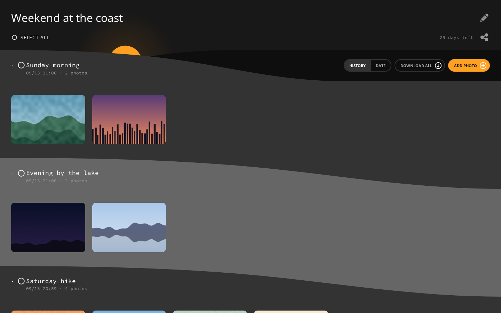

<p align="center">
  
</p>
<h1 align="center">PhotoBin</h1>
<p align="center">Temporary, end-to-end encrypted photo albums. Create one, share the link, everyone uploads and downloads. Gone in 30 days.</p>

<p align="center">
  
</p>

## Features

- **End-to-end encrypted.** The albumId is random long text which is hard to guess, only you and the server knows it, to ensure that only you can see the album there is also a key living only in the URL's `#fragment` which are cut off from the URL by the browser before any request to the server. Of course, it's up to you how safe you want to handle that key. 
- **No accounts.** Anyone with the link can add, view, download and delete photos.
- **Photos, videos and RAW.** RAW files ride along with their JPG and optionally download together.
- **Fast, resumable uploads.** Chunked, parallel, retried on flaky networks, resumed after a reload.
- **Photo viewer.** Zoom, pan, swipe, non-destructive rotation; pinch the grid to change the column count.
- **Upload history.** Every drop is a named group; switch to a by-date view any time.
- **Download all as a zip**, or just what you selected.
- **Self-destructs.** Albums expire after 30 days (configurable).

## Development

Runs in Docker (rootless Docker or Podman recommended); sources are mounted, both servers hot-reload.

```bash
make install   # frontend/.env from the sample, npm install in both containers
make start     # frontend :3000, backend :3001
make stop
```

## Production

Two images: the backend (Node) and the frontend (static build served by Caddy, which also proxies `/api` to the backend). Albums are stored in `./data/albums`.

```bash
make prod-install   # creates compose.prod.override.yml from the sample, builds both images
make prod-start     # http://localhost:8080
make prod-stop
make prod-update    # rebuild after a pull, keeps your override; then make prod-start
```

`compose.prod.override.yml` (gitignored) holds the port and the backend's environment: `ALBUM_TTL_MS`, `CLEANUP_INTERVAL_MS`, `ORPHAN_TTL_MS`, `EDIT_LOCK_TTL_MS`. The stack speaks plain HTTP; put your own TLS reverse proxy in front of port 8080.

## License

[AGPL-3.0](LICENSE)
